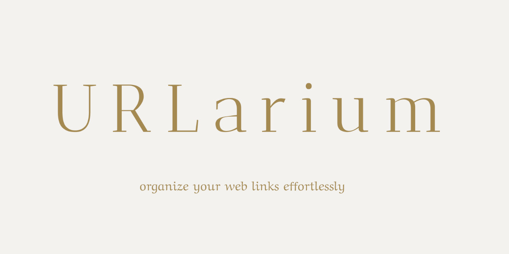

  

# URLarium

**URLarium** is a simple WordPress plugin for managing and organizing URLs within the WordPress admin panel.

## Features

* Manage a list of websites (URLs) directly from the WordPress dashboard
* Add new websites easily
* Categorize URLs for better organization
* Help section integrated into the plugin menu
* User-friendly interface and straightforward operation

## Installation

1. Upload the plugin to the `/wp-content/plugins/` directory or install it via the WordPress Plugin Directory.
2. Activate the plugin through the “Plugins” menu in WordPress.
3. A new **URLarium** menu will appear in the admin panel with options: websites list, add new website, categories, and help.

## Configuration

In the **URLarium** menu you can:

* Add new URLs to your collection
* Manage categories for your URLs
* View and edit existing URLs
* Use the Help tab for guidance on how to use the plugin

## Requirements

* WordPress 5.8 or higher
* PHP 7.2 or higher

## License

This plugin is licensed under the [GPL v2 or later](https://www.gnu.org/licenses/gpl-2.0.html).

---

**Author:** marcin-filipiak
**Plugin Homepage:** https://github.com/marcin-filipiak/wordpress_urlarium

